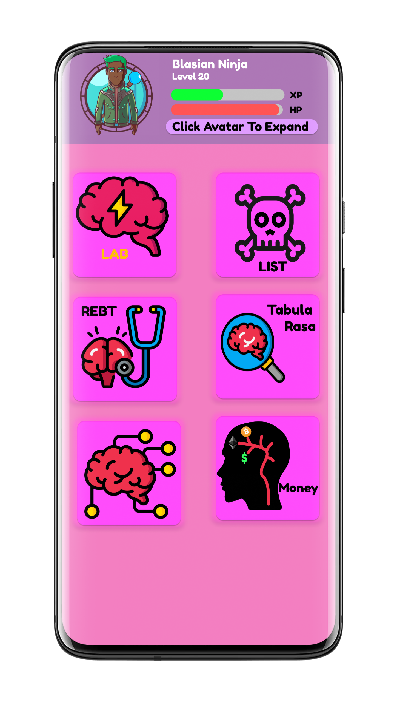

# SuperIntelligence_Psyche

  

> Technology keeps getting smarter each year, but our brains do not. It's time to reverse that! Meet, SuperIntelligence Psyche or Super Psyche for short, an application that helps humans of all walks of life to learn faster, improve their memory and change their lives. This application is inspired by Neuro Linguistic Programming and Neuroscience.You are not stuck with the same brain you had yesterday and this application can prove it. 

- [x] Research
- [ ] Figma Mockup <!--  or (link to image.png) --> : [Live Mockup](https://www.figma.com/file/zN98jDnM9LpLAe7RxeCYaq/Super-Psyche?node-id=0%3A1)

- [ ] Programming

- [ ] Testing

- [ ] Release.   *ETA December 2020, subject to change*
