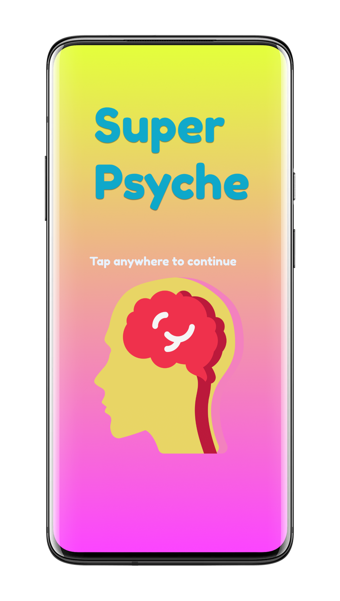
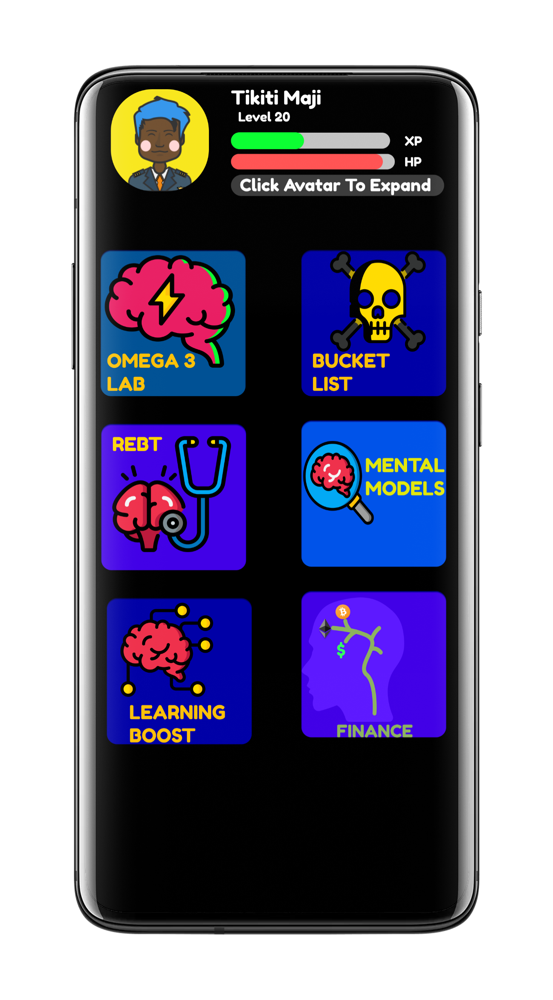

# Super_Psyche
<!-- If Neuro Linguistic Programming is the programming language of the brain then Super Psyche is the scripting language of the Brain. -->
  

## Coming Soon...

          

 Technology keeps getting smarter each year, but our brains do not. It's time to reverse that! Meet, Super Psyche, an application that helps humans of all walks of life to learn faster, improve their memory and change their lives. This application is inspired by Neuro Linguistic Programming and Neuroscience.You are not stuck with the same brain you had yesterday and this application can prove it. 
 

🧠 Q&A

 
 
 
 1. **What is Super Psyche?**
 - A gamified brain health application that utilizes the vast research available in Neuroscience to help users learn faster and achieve more. 

2. **Who is the target audience for Super Psyche?**
- Its for anyone who wants a better brain, if that's you, then this app is for you.

3. **Where will this application be available once its realeased?**
- Cross-platform is the primary goal. Android & Linux distributions will probably be my top priority. Android, Linux, Web (extension), Windows and Mac OS.
 
4. **When do you plan to release this application?**
- I am aiming for the year 2025, but its highly possible to build this app before then. 2025 is SMART goal (specific, measurable, achievable, relevant and time based)

5. **Why are you building this application in the first place?**
- I searched around the internet and i couldn't find the application that i was looking for. I found apps that were close to what i was looking for, but they were still lacking. So, i decided, why not just create the application you are looking for, if it's not avaialable? This project begun with the inital question og, why not? and its also inspired by a few other apps that i have used that are listed below:
- [Mindvalley Learn](https://play.google.com/store/apps/details?id=com.mindvalley.mva&hl=en&gl=US)
- [LifeUp](https://play.google.com/store/apps/details?id=net.sarasarasa.lifeup)
- [Habitica](https://play.google.com/store/apps/details?id=com.habitrpg.android.habitica)
- [TaskHero](https://play.google.com/store/apps/details?id=com.whetware.taskhero)
- [Lumosity](https://play.google.com/store/apps/details?id=com.lumoslabs.lumosity)
- [Elevate](https://play.google.com/store/apps/details?id=com.wonder)
- [NeuroNation](https://play.google.com/store/apps/details?id=air.nn.mobile.app.main)

6. **Where can i find detailed documentation?**
-  [Full Documentation](https://github.com/33nanoseconds/Super_Psyche/wiki)
- [Powerpoint Edition](https://docs.google.com/presentation/d/1MlaihAx6TEqfneiyi7D0FL3pS1UL2U4OfzCMcQk7JIo/edit?usp=sharing)
- [Word Doc Edition](https://docs.google.com/document/d/1lSfp3UqQMRwGeqk56f6Exv3oANzqhsm5YFiFfH_EKeE/edit?usp=sharing)
- [Spreadsheet Edition](https://docs.google.com/spreadsheets/d/e/2PACX-1vQZiTF5r39gh5knUuTG3TNmUkKh2FZtEI1zuyge-ur8nyL2hGnD_f5ez_-wHkMka1CsfIsRrXlrTIup/pubhtml)
- [Wiki Edition](https://github.com/33nanoseconds/Super_Psyche/wiki)
- [Comprehensive Edition](N/A) - Free eBook (coming soon, December 2021)

7. **What programming language are you planning to use to build this?**
- The project decides the language, thats not something you get to decide before hand. I was thinking of using Dart and the flutter framework, but i might end up using Kotlin or Java for the Android portion, and maybe Go for the desktop application. Heck i might even use javascript, even though i despise it and believe that it should only be used in the browser and not for desktop apps.

8. **How do you plan to market this app, once you build it?**
- Thats a bad approach, its better to sell your vision before you actually build the thing. Thats how trailers work and it just so happens to work for development as well. A game developer shows you gaming footage of what their game looks like before they finish it. 

9. **Are you qualified to create this kind of application?**
- I dont credentials stop me from creating value for others even if that person is only me or handful of people. Thats the beauty of the permissionless mindset

10. **Do you plan on adding any animations and if so how?**
- I do plan on adding some animations, but i will probably keep it to a minimal. I plan on using the Rive App to do that, because i feel that its better than using SVGator which would require that i use react native. Rive has an API that implement flawlessly into flutter and kotlin apps. SVGator is limited to exporting CSS and javascript (web optimized, duh).

11. **Do you plan on makinf Super Psyche look just like mockup screenshots that you created in Figma?**
- Most definitely, but it with some changes to the size, color scheme and icon placement. I only have an idea of what i want the splashscreen to look like and the main UI

12. **Are you really planning on adding a bucket list feature?**
- I know its morbid, but i plan to gamify that feature, so there is definitely going to be a paradigm shift.

13. **What sort of style does the bucket list feature that you wish to implement possess?**
- It will have the same sort of style as the TED Talk video that Ben Nemtim gave, Its loosely based on his book as well and another TED Talk video by Travis Bell

14. **What will the mental models button contain?**
- This feature will have a multitude of mental models collected across various streams of research, but refined and renamed to gaming terms. Well, sme gaming names and made up words in order to avoid copyright and make it look unique. Everyone will have access to one mental model and the rest will be locked. Only when you level up and complete quests is when you unlock more mental models. Nothing is paywalled, its all intellectuall prowesss. The first mental model will be Kaizen

15. **Will users be able to add their own mental models?**
- I have thought about it and to be sincere, i might have two version of the app, rather a stable and a nightly version. The stable version wont have many options when it comes to customization, but nightly version will. 

16. **What exactly will the REBT feature do?**
- My initial plan for it sounded ridiculous, almost like some fantasy dream because it is. I was thinking of adding the feaure that enables you to talk to the app. The feature functions like your neurotherapist, but thats requires load of resources and engineering. Natural language processing isnt there yet and cant possibly function to a neuroscientific degree (Rational Emotive Behvior Therapy). The REBT feature will simply contain an index/ dictionary of language patterns and neurolinguistic programming dispute to the ABC equation of reasoning (D &E)

17. **How will the learning boost feature work?**
- For this part of the program, i plan on making it link with a persons Second Brain (Digital note taking system). It would definitely be easier to implement with the Foam VScode extension, markor app and Obsidian than other note taking tools. 

 

